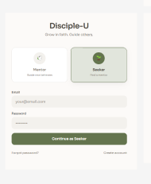
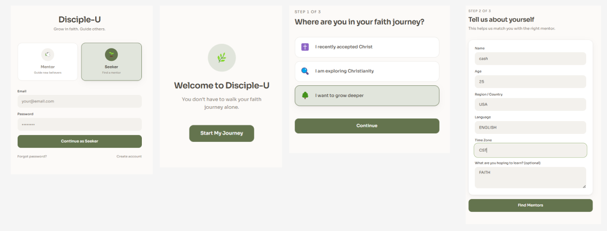
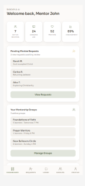
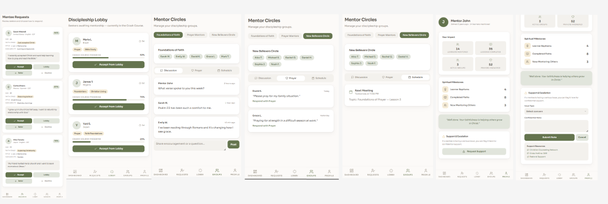

# Disciple-U: Mentorship Platform

Disciple-U is a mentorship platform prototype designed to connect seekers with mentors and guide them through a structured faith and discipleship journey.

This project was developed during the **OneHope Lock-In Lab Innovation Program**, where our team explored how technology can support spiritual growth, mentorship, and meaningful community engagement.

## Problem
Many individuals who begin exploring faith do not have access to structured mentorship, guided learning, or consistent community support. This can make spiritual growth feel disconnected or unsupported.

## Solution
Disciple-U is designed as a digital mentorship platform that connects seekers with mentors and provides a guided pathway for learning, reflection, prayer, and community engagement.

## My Contribution
• Contributed to conceptualizing the product vision and mentorship journey  
• Helped shape the structured pathway: **Seeker → Believe → Grow → Mentor**  
• Supported product strategy discussions around engagement and user experience  
• Participated in presenting the concept to mentors and program leaders  

## Product Focus
This project explores how digital platforms can support:

- Human-centered mentorship experiences  
- Community-driven digital engagement  
- Behavioral journey design  
- Faith-based platform innovation  

## Prototype & UX Design
The concept prototype and design exploration for Disciple-U can be viewed in the Figma file below:
[Disciple-U Prototype – Figma Design](https://www.figma.com/design/ALZ4o53sjwraAKBEt3AaAV/Team-1?node-id=12-2&t=i4NvnaRuortXqya6-1)

## Presentation
You can download the project overview presentation here:
[Disciple-U Concept Presentation (Canva)](https://www.canva.com/design/DAHFEgeoGZg/CxmhutuP67MjJtPe95yX6Q/edit?utm_content=DAHFEgeoGZg&utm_campaign=designshare&utm_medium=link2&utm_source=sharebutton)

## Screenshots

### Seeker Onboarding

### Seeker Journey

### Mentor Dashboard

### Mentorship Flow

## Note
This repository highlights **product thinking, UX design, and solution development** rather than production code.
